# Appointment Reminder App

A full-stack appointment management system with automated email reminders.

## Features

* User Authentication (JWT-based login & signup)
* Create, update, delete appointments
* Automated email reminders before appointments
* Retry mechanism for failed email delivery
* Timezone-safe (stored in UTC, displayed in local time)
* FastAPI backend with async scheduler
* React frontend deployed on Vercel

---

## Tech Stack

### Backend

* FastAPI
* PostgreSQL (Neon DB)
* SQLAlchemy
* APScheduler
* AsyncIO

### Frontend

* React.js
* Axios
* CSS

### Deployment

* Backend: Render
* Frontend: Vercel

---

## How It Works

* Appointments are stored in UTC
* Scheduler runs every minute
* If current time ≥ (appointment time - reminder window)
* Email is sent automatically
* Failed emails are retried up to 3 times

---

## Installation (Backend)

```bash
git clone <https://github.com/Af-Dammia/appointment-app-backend.git>
cd backend
python -m venv venv
venv\Scripts\activate   # Windows
pip install -r requirements.txt
uvicorn app.main:app --reload
```

---

## Frontend Setup

```bash
cd frontend
npm install
npm start
```

---

## Demo

### Sign In
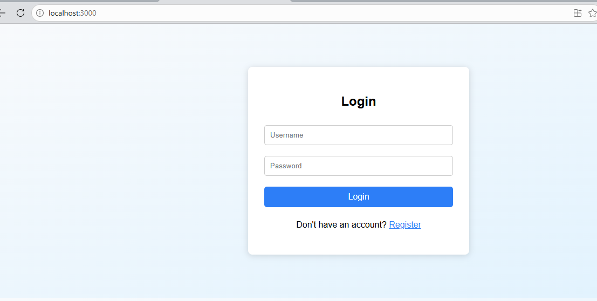
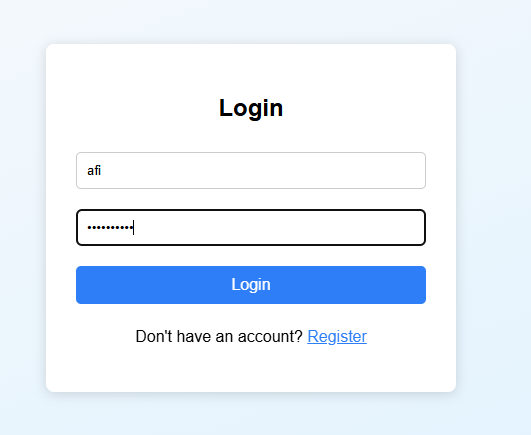
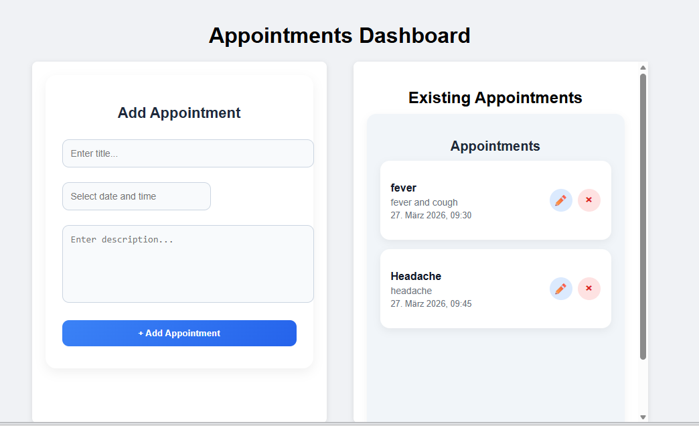

### Add Appointment

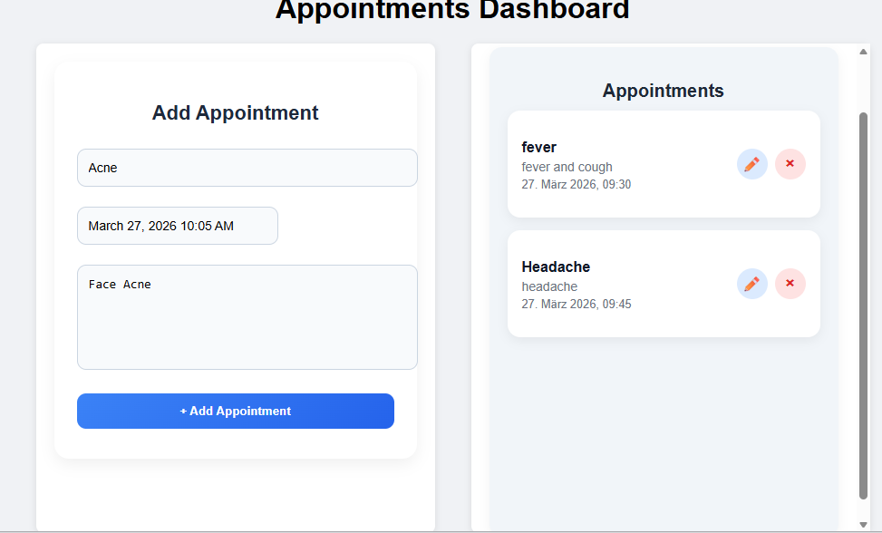
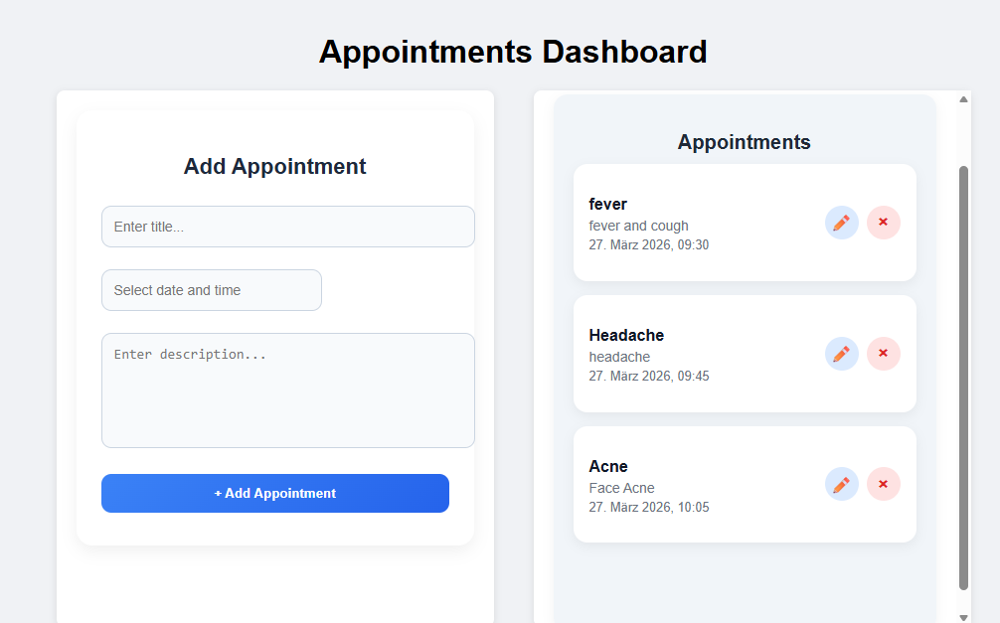
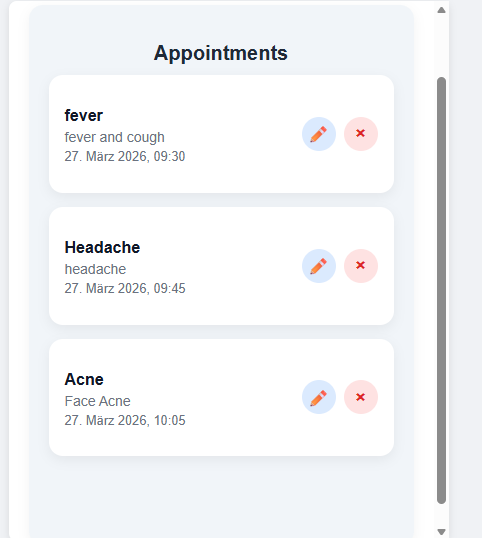
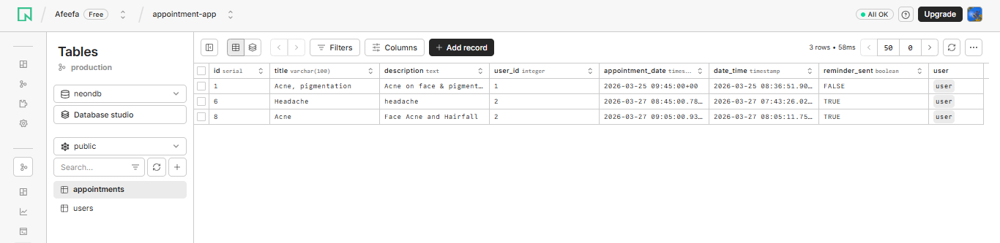

### Delete Appointment
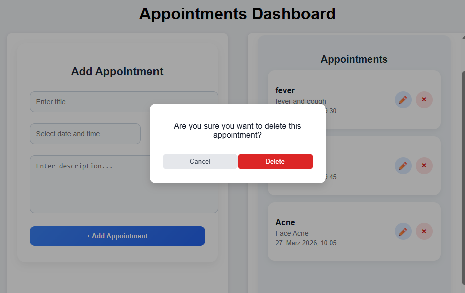
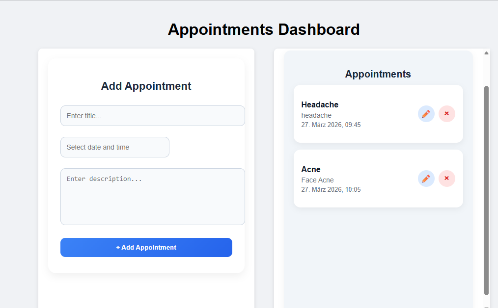
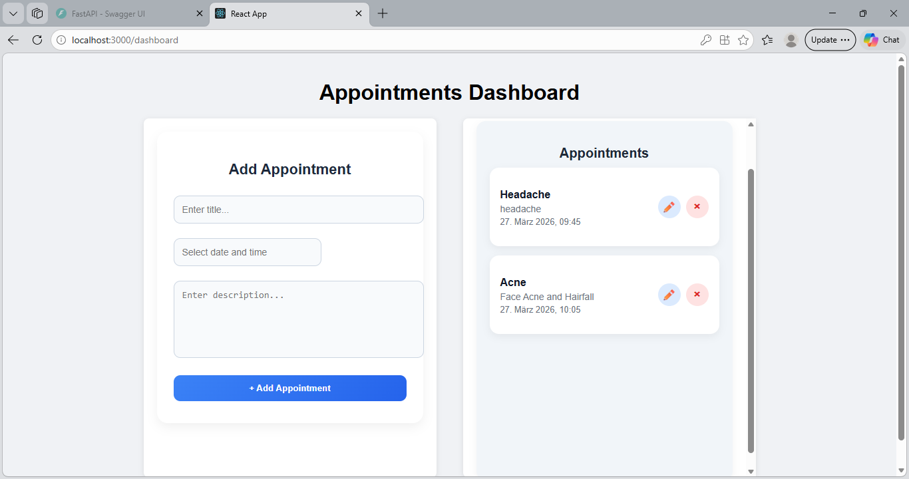

### Update Appointment
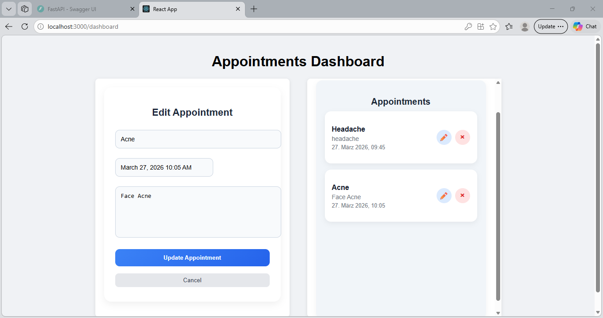
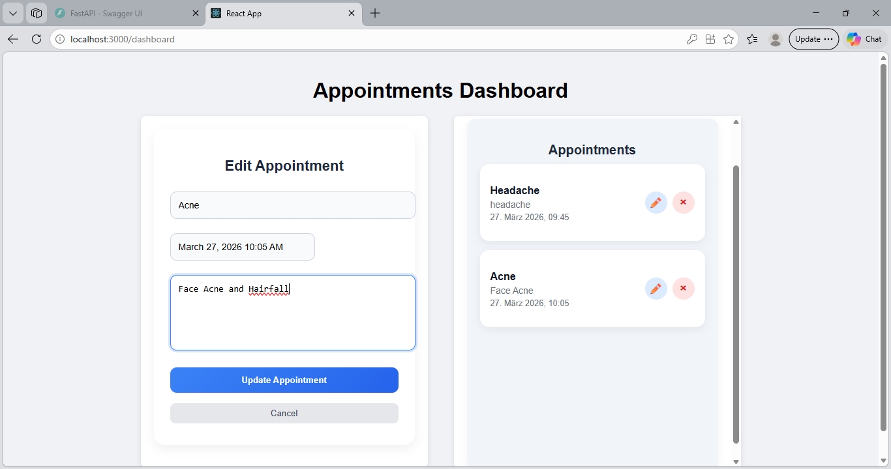
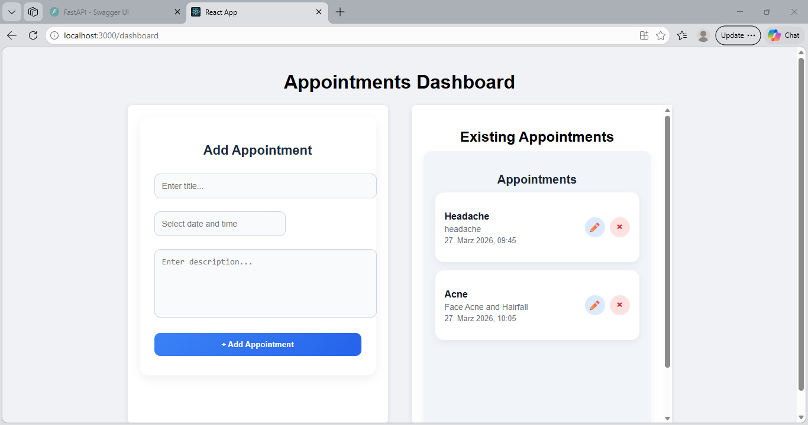

### Invalid User or Password
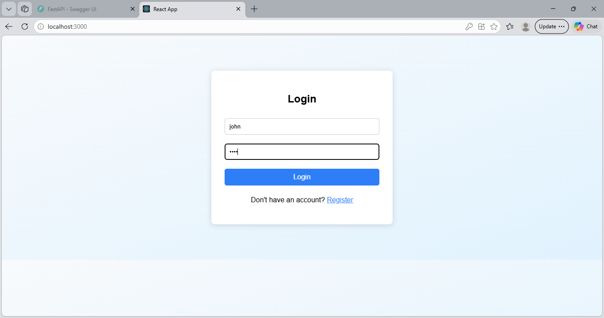
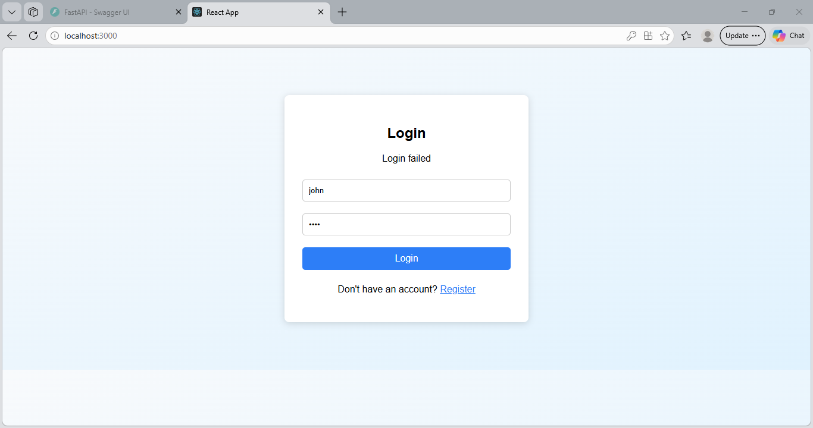
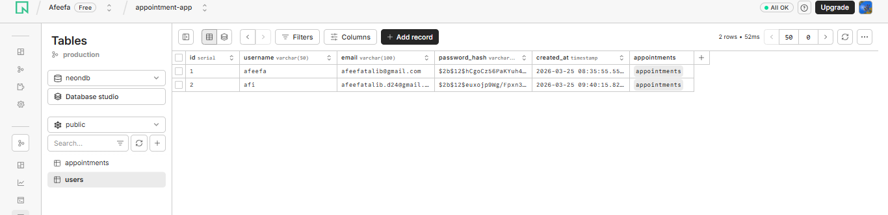

### New User Registration
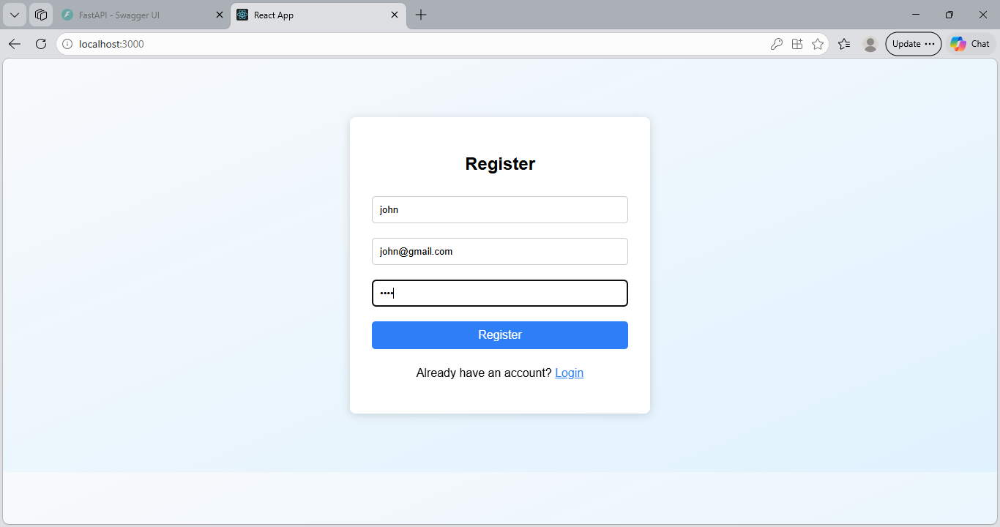
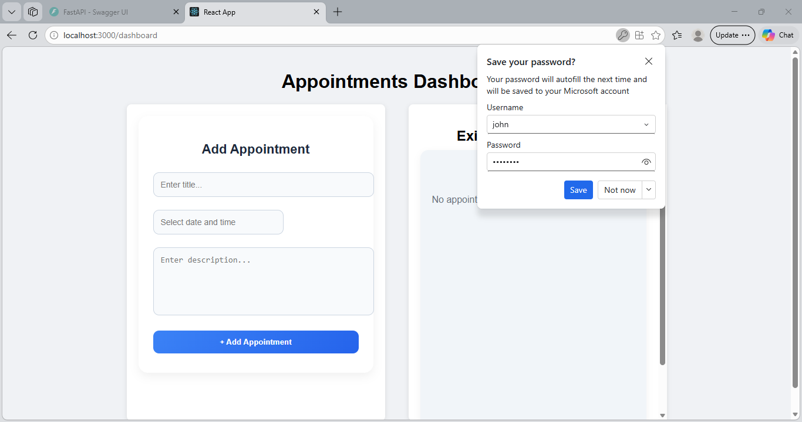
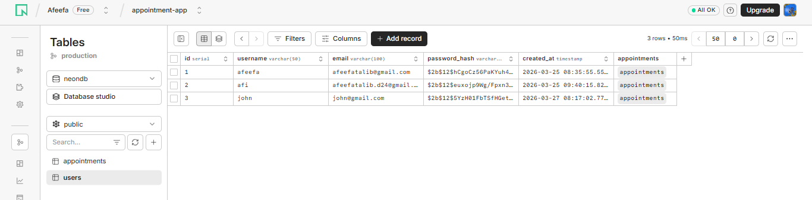

### Console Log for Sendind E-Mail Reminder
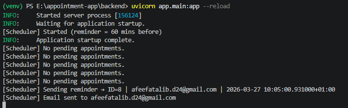
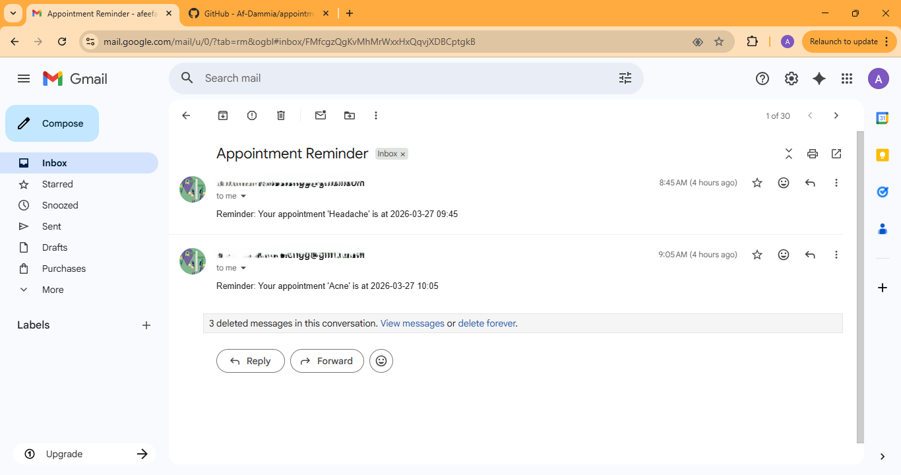
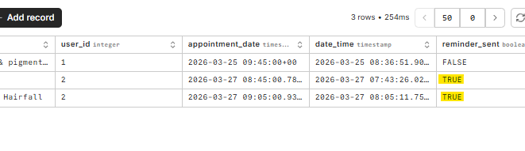

---

## Future Improvements

* Dashboard with upcoming appointments highlighted
* Real-time notifications
* Mobile responsiveness
* Email templates (HTML styling)
* Role-based access control (admin vs user)
* Background worker system

---

## Author

GitHub: https://github.com/Af-Dammia/ 
